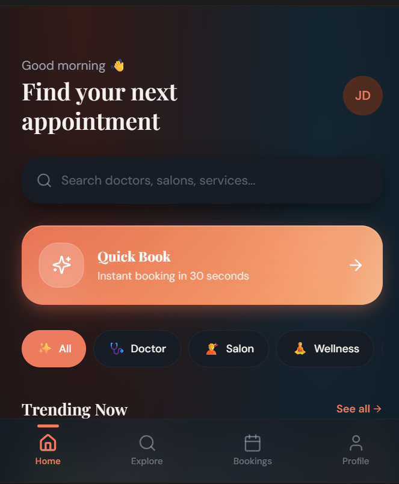
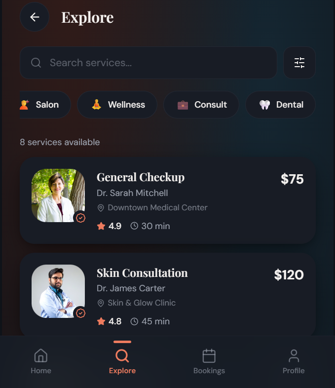
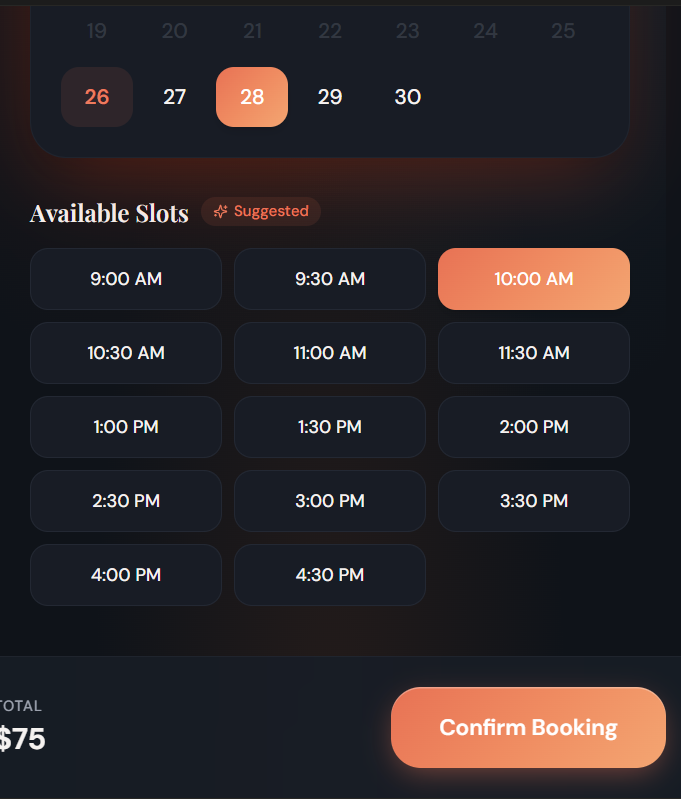
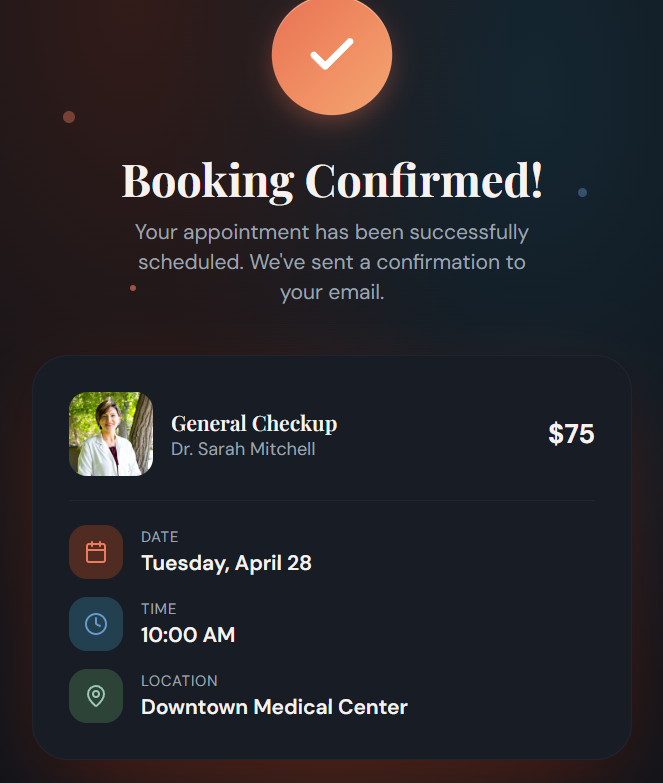

# FUTURE_UX_02
Mobile App UI for appointment booking with a focus on user flow and simple interaction design.
# 📱 FUTURE_UX_02 – Mobile App UI for Appointment Booking

## 📌 Task Objective
To design a mobile app UI that simplifies appointment booking.

## 🎯 Problem
Users face difficulty booking appointments due to complex steps.

## 💡 Solution
Designed a simple and intuitive mobile UI for smooth booking.

## 🔄 User Flow
- Home
- Service selection
- Date & time selection
- Confirmation

## 🚀 Key Features
- Clean mobile UI
- Quick booking option
- Easy navigation

## 🧠 UX Decisions
- Reduced steps
- Clear interaction flow
- Simple layout

## 📸 Screenshots
(Add images here)

## 📽 Demo
Video shared on LinkedIn.

## Screenshots

### Home Screen

### Explore Screen

### Booking Screen

### Confirmation Screen

